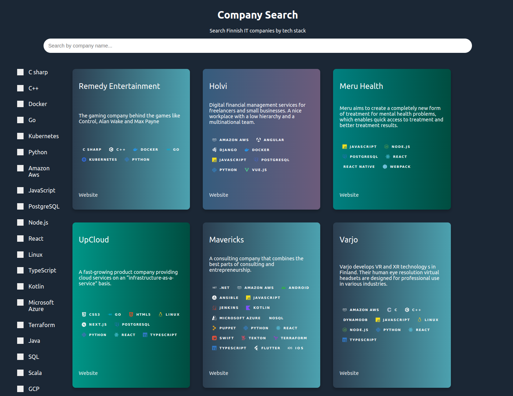

# 🎛️ Company Stack Viewer

You can search companies by their tech stack using this interface:

 

## Adding a Company
If you would like to add your own company info simply fork the repo and add the data to [this](../data/data.yaml)  `.yml` file.
Make a pull request and as soon as it is merged your contribution will be visible on the web interface.

**Note:** The web interface uses [sheilds.io](https://shields.io/badges) badges to fetch the tech icons so make sure to write the name of the technology correctly. The safest way is to copy it from an already existing record in the same `.yml` file.&#x20;
